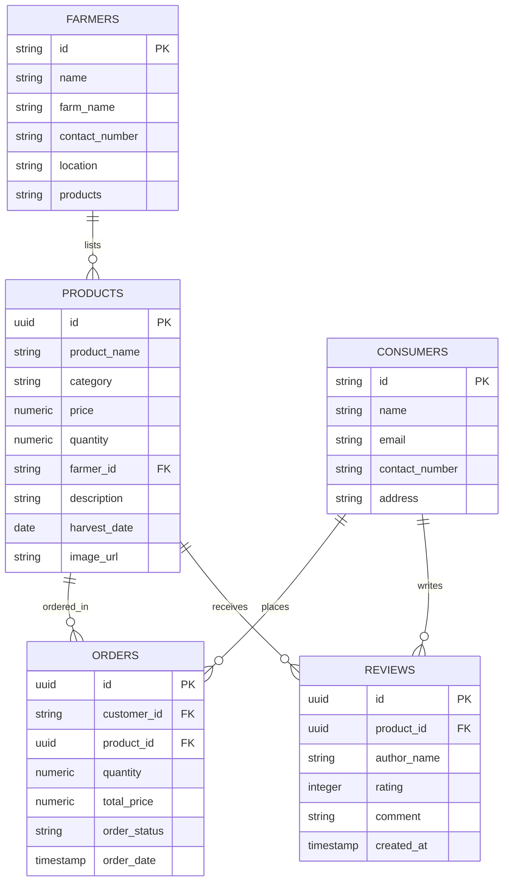

# FarmConnect: Direct Farmer-to-Consumer Marketplace

**MINI PROJECT WORK SUBMITTED IN PARTIAL FULFILLMENT OF THE REQUIREMENTS FOR THE AWARD OF THE DEGREE OF BACHELOR OF COMPUTER SCIENCE**

---

### Submitted By
**THANYA SUSILA NB**  
**24SBCS108**

### Guided By
**Dr. V. Abinaya, MCA., M.Phil., Ph.D**  
Assistant Professor  
Department of Computer Science  

---

**DEPARTMENT OF COMPUTER SCIENCE**  
**PSGR KRISHNAMMAL COLLEGE FOR WOMEN**  
*Affiliated to Bharathiar University | Autonomous | College of Excellence | Accredited with A++ Grade | Ranked 9th in NIRF*  
*Coimbatore - 641004*  
**AUGUST 2026**

---

## DECLARATION

I hereby declare that this project work entitled **"FarmConnect: Direct Farmer-to-Consumer Marketplace"** submitted for the award of the Degree of Bachelor of Computer Science is a record of the original work done by **THANYA SUSILA NB (24SBCS108)** under the supervision and guidance of **Dr. V. Abinaya, MCA., M.Phil., Ph.D**, and this project work has not formed the basis for the award of any degree or similar title to any candidate of any university.

  

**Place:** Coimbatore  
**Date:**  

 

  <strong>THANYA SUSILA NB</strong> 
  24SBCS108

  

 

  <strong>Endorsed By</strong>

  

**Place:** Coimbatore  
**Date:**  

  <strong>Dr. V. Abinaya</strong> 
  Faculty Guide

---

## CERTIFICATE

This is to certify that the mini project work entitled **"FarmConnect: Direct Farmer-to-Consumer Marketplace"** submitted to Bharathiar University in partial fulfillment of the requirement for the award of the Degree of Bachelor of Computer Science is a record of the original work done by **THANYA SUSILA NB (24SBCS108)**, during her period of study in the Department of Computer Science, PSGR Krishnammal College for Women, Coimbatore, under my supervision and guidance, and her mini project work has not formed the basis for the award of any degree or similar title to any candidate of any university.

   

**Dr. V. Abinaya**  
Faculty Guide  

  <strong>Dr. S. Karpagavalli</strong> 
  Head of the Department

   
**Submitted for final examination held on date:** 

---

## ACKNOWLEDGEMENT

I proudly thank **Dr. R. Nandini, Chair Person**, PSGR Krishnammal College for Women, Coimbatore, for having given me the opportunity to undertake this mini project work.

I extend my profound gratitude to **Dr. N. Yesodha Devi, Secretary**, PSGR Krishnammal College for Women, Coimbatore, for the opportunity to undertake this mini project.

I extend my thanks to **Dr. P. B. Harathi, Principal**, PSGR Krishnammal College for Women, Coimbatore, for her support and the resources provided.

I am extremely grateful to **Dr. S. Karpagavalli, Head of the Department**, Department of Computer Science, PSGR Krishnammal College for Women, Coimbatore, for her continuous support and encouragement to complete this mini project successfully.

I express my sincere thanks to my Faculty Guide, **Dr. V. Abinaya, Assistant Professor**, Department of Computer Science, for her valuable guidance, constant motivation, and constructive suggestions throughout the course of this mini project.

  

  <strong>THANYA SUSILA NB</strong>

---

## SYNOPSIS

This report explains the design and development of **FarmConnect: Direct Farmer-to-Consumer Marketplace**, a web-based Agri-Tech application. The main purpose of this system is to eliminate exploitative multi-tier mandi middlemen and connect local farmers directly with end-consumers through a single unified platform. It helps farmers list crops, manage received orders, and calculate revenue, while enabling consumers to purchase fresh organic produce and verify food origin.

The application has five core modules: **Home Dashboard**, **Marketplace & Cart**, **Digital Farm Passport**, **AI Fair-Price Estimator**, and **Logistics & Order Tracker**. The Home Dashboard provides an overview of the platform, transaction stats, and localized activity feeds. The Marketplace allows users to filter produce by category (Fruits, Vegetables, Grains, Organic) and search crops. The Digital Farm Passport provides detailed food traceability, farm GPS coordinates, and soil health reports via dynamic QR codes. The AI Fair-Price Estimator calculates net income increases for farmers and savings for consumers.

The system also includes full bilingual support in **English** and **Tamil (`தமிழ்`)** to ensure rural farming communities can navigate the application easily. The backend utilizes **Supabase** as a cloud Postgres database with an automatic LocalStorage database fallback for offline resilience.

This report explains the software and tools used to build the application. It describes the main features of each module, the database tables, and the layout screens. It also details how the application simplifies agricultural supply chains and empowers rural farmers.

---

## CONTENTS

| CHAPTER | TITLE | PAGE NO |
| :---: | :--- | :---: |
| | **ACKNOWLEDGEMENT** | **I** |
| | **SYNOPSIS** | **II** |
| **1** | **INTRODUCTION** | **1** |
| | 1.1 Project Overview | 1 |
| | 1.2 System Environment | 2 |
| | 1.3 Software Features | 2 |
| **2** | **SYSTEM STUDY** | **4** |
| | 2.1 Background Study | 4 |
| | 2.2 Modules in FarmConnect | 4 |
| | 2.3 Advantages of the System | 5 |
| | 2.4 Entity Relationship | 6 |
| **3** | **SYSTEM DESIGN** | **7** |
| | 3.1 Input / Interaction Screens | 7 |
| | 3.2 Table Design | 10 |
| | 3.3 Output Screen | 12 |
| **4** | **CONCLUSION** | **14** |

---

### CHAPTER 1
## 1. INTRODUCTION

**FarmConnect** is a web-based C2C agricultural commerce application developed to make the direct trade of fresh produce easy, transparent, and profitable. In many traditional supply chains, mandi traders and brokers claim over 60% of crop value, leaving small-scale farmers with low profit margins. FarmConnect reduces these problems by storing list information, transaction logs, and buyer profiles in a digital format. 

Users can access the application from any device using a web browser. Farmers can log in, upload crop photos, list quantities, and manage orders without leaving their farms. Consumers can purchase chemical-free, fresh farm harvests at lower prices than supermarket retail. All transaction logs and certificates are stored securely in one place, making it easy to access whenever needed.

### 1.1 Project Overview
FarmConnect is a single-page web application designed to connect farmers directly with buyers. The platform provides:
1. **Interactive Marketplace**: Allows consumers to search and filter local crops.
2. **Digital Traceability Certificates**: Generates a verified farm passport showing soil data and exact GPS locations.
3. **AI Price Estimator**: An analytical calculator showing direct income gains vs mandi rates.
4. **Order Management Suite**: Tracks shipment delivery stages and generates printable invoices.

---

### 1.2 System Environment
FarmConnect is a browser-based application. During development, the application is tested on a local server using `localhost:8000`.

| Component | Details |
| :--- | :--- |
| **Application Type** | Single-Page Web Application (SPA). |
| **Front-End** | HTML5, Vanilla CSS3 (Custom variables, glassmorphism), ES6 JavaScript. |
| **Routing** | Client-side hash routing (`#/shop`, `#/cart`, `#/consumer-dashboard`). |
| **Backend** | Supabase (Cloud PostgreSQL) with LocalStorage DB fallback. |
| **Libraries & APIs** | Lucide Icons CDN, QRServer API (for QR Traceability). |
| **Browser Support** | Google Chrome, Mozilla Firefox, Microsoft Edge, Safari. |

### 1.3 Software Features
FarmConnect features a modern, clean, responsive green-themed design:
* **Sidebar / Top Navigation Menu**: Quick links to Home, Shop, and dashboards.
* **Bilingual Switcher**: Real-time localization toggle between English and Tamil (`தமிழ்`).
* **Live Activity Ticker**: Automatically displays sliding notices of recent marketplace activity (e.g., registrations, purchases).
* **Supabase Status Pill**: Dynamic header status indicator displaying green (`Supabase Connected`) or red (`LocalStorage Mock DB`).

---

### CHAPTER 2
## 2. SYSTEM STUDY

### 2.1 Background Study
Agricultural markets in India are heavily dependent on commission agents (middlemen) operating in APMC mandis. While they facilitate sales, they take high commissions and delay payments. A direct digital marketplace allows farmers to bypass these middlemen. By matching buyer orders with listed harvests, payments are made directly, crop quality is preserved, and delivery times are halved.

### 2.2 Modules in FarmConnect
1. **Home Dashboard**
   * Displays welcome banners, platform statistics (total farmers, active products, completed orders), and featured items.
   * Runs the real-time sliding live activity ticker feed.
2. **Marketplace & Cart**
   * Renders the crop inventory with dynamic availability tags.
   * Handles shopping cart quantities and manages checkout validations.
3. **Digital Farm Passport**
   * Renders a verified crop certificate modal displaying soil pH, organic cert IDs, GPS locations, and dynamically generated QR codes.
4. **AI Price Calculator**
   * An interactive modal calculator that computes Mandi middleman rates vs Direct pricing to show farmer profit margins.
5. **Consumer / Farmer Dashboards**
   * *Consumer*: Displays order tracking, shipment status timeline, and generates printable tax invoices.
   * *Farmer*: Allows farmers to list new crops and manage order fulfillment.

---

### 2.3 Advantages of the System
* **Direct Profits**: Farmers earn **+185% higher net income** by pocketing the middlemen's margins.
* **Consumer Savings**: Consumers buy fresh organic produce **~15% cheaper** than retail supermarkets.
* **Transparent Traceability**: Dynamic QR codes allow consumers to verify where and how their food was grown.
* **Bilingual Inclusivity**: Tamil translation ensures local regional compatibility.
* **Cloud Syncing**: Supabase database ensures secure, real-time records.

### 2.4 Entity Relationship (ER) Diagram

---

### 2.5 Data Flow Diagram

The Data Flow Diagram (DFD) maps the flow of information through the FarmConnect platform across three distinct levels of abstraction:

#### Level 0 (Context Level DFD)
The Level 0 DFD defines the boundary of the FarmConnect system. The central process "0.0 FarmConnect System" receives crop listings and stock levels from the "Farmer" external entity and sends back sales stats and order notifications. The "Consumer" external entity sends buyer registrations and purchase checkouts to the system, receiving crop origin certificates, invoices, and shipment tracking in return. The "Admin" manages system logs and audits listings.

#### Level 1 (Functional Level DFD)
The Level 1 DFD decomposes the system into main functional blocks: the Marketplace & Cart System, the Farmer Portal, the Digital Farm Passport system, the AI Price Calculator, and the Logistics & Invoicing system. It documents the flow of credentials, product structures, order states, and review comments across the database.

#### Level 2 (Process Level DFD - Ordering Process)
The Level 2 DFD details the transactional database sequence when a consumer places an order. The consumer searches products, checks the farm passport, and registers/logs in. Upon clicking checkout, the system validates the stock levels in the Products DB, creates a new order in the Orders DB, decrements the available quantity, and generates the print-ready GST Tax Invoice.

---

### CHAPTER 3
## 3. SYSTEM DESIGN

The system design of FarmConnect is clean, intuitive, and roles-focused. The application interface separates functionalities for farmers, consumers, and administrators. 

### 3.1 Input / Interaction Screens
FarmConnect captures user input through structured, validated web forms. These input screens are grouped together on a single page to maintain layout flow:

* **Fig 3.1.1: Marketplace Search & Category Filters**: Renders the crop grid, category filter pills (*Vegetables, Fruits, Grains, Organic*), and search input for finding produce by name or farmer location.
* **Fig 3.1.2: AI Fair-Price & Profit Margin Estimator**: The interactive calculator overlay where users input crop variety and harvest weight (kg) to dynamically compare Mandi middleman rates against direct sales margins.
* **Fig 3.1.3: Farmer Portal – Crop Listing Wizard**: The farmer's form interface to register a new crop harvest, capturing crop name, price, available quantity, description, harvest date, and image URL.

---

### 3.2 Table Design
The database structure consists of five primary tables configured in Supabase to maintain system integrity and relation constraints:

#### 1. Farmers Table (`public.farmers`)
Stores farm profiles and seller contact data.

| Column Name | Data Type | Description |
| :--- | :--- | :--- |
| `farmer_id` | `TEXT` | Unique farmer username / Auth ID (Primary Key) |
| `name` | `TEXT` | Full name of the farmer |
| `farm_name` | `TEXT` | Registered farm name |
| `contact_number` | `TEXT` | Mobile contact number |
| `location` | `TEXT` | Farm geographic location (City, State) |
| `products` | `TEXT` | List of crops grown by the farmer |

#### 2. Consumers Table (`public.consumers`)
Stores buyer profiles and shipping details.

| Column Name | Data Type | Description |
| :--- | :--- | :--- |
| `consumer_id` | `TEXT` | Unique consumer username / Auth ID (Primary Key) |
| `name` | `TEXT` | Full name of the buyer |
| `email` | `TEXT` | Email address for invoicing (Unique) |
| `contact_number` | `TEXT` | Mobile contact number |
| `address` | `TEXT` | Detailed shipping and delivery address |

#### 3. Products Table (`public.products`)
Stores active crop harvest listings.

| Column Name | Data Type | Description |
| :--- | :--- | :--- |
| `product_id` | `UUID` | Generated unique product identifier (Primary Key) |
| `product_name` | `TEXT` | Name of the crop variety |
| `category` | `TEXT` | Crop category (Fruits, Vegetables, Grains, Organic) |
| `price` | `NUMERIC(10,2)` | Price in Rupees per kilogram |
| `quantity` | `NUMERIC(10,2)` | Available stock weight in kilograms |
| `farmer_id` | `TEXT` | References farmer profile ID (Foreign Key) |
| `description` | `TEXT` | Short product details (Optional) |
| `harvest_date` | `DATE` | Crop harvest date |
| `image_url` | `TEXT` | Link to product display photo (Optional) |

#### 4. Orders Table (`public.orders`)
Stores client checkout transactions.

| Column Name | Data Type | Description |
| :--- | :--- | :--- |
| `order_id` | `UUID` | Generated unique order transaction ID (Primary Key) |
| `customer_id` | `TEXT` | References buying consumer ID (Foreign Key) |
| `product_id` | `UUID` | References purchased product ID (Foreign Key) |
| `quantity` | `NUMERIC(10,2)` | Ordered weight in kilograms |
| `total_price` | `NUMERIC(10,2)` | Final amount charged in Rupees |
| `order_status` | `TEXT` | Fulfillment status ('Pending', 'Shipped', 'Delivered') |

---

### 3.3 Output Screens
The output screens display dynamic dashboards, tracking timelines, and printable invoices. These are grouped on a single page:

* **Fig 3.3.1: Digital Farm Passport Certificate**: The organic certificate card containing soil health statistics, verified GPS coords, carbon offset values, and a scannable QR trace code.
* **Fig 3.3.2: Consumer Dashboard & Shipment Timeline**: Displays the list of customer purchases with a 4-stage tracking timeline (*Placed, Packed, In Transit, Delivered*).
* **Fig 3.3.3: Direct Sales GST Tax Invoice**: A print-ready invoicing template generated for checkout bills, detailing the seller, buyer, price, quantity, CGST/SGST tax breakdown, and the final grand total.

---

### CHAPTER 4
## 4. CONCLUSION

**FarmConnect: Direct Farmer-to-Consumer Marketplace** is a responsive web application designed to empower small-scale farmers and provide consumers with fresh, chemical-free food. By utilizing client-side single-page hash routing, vanilla CSS3 styling, and a Supabase cloud database backend, the application runs efficiently in modern browsers and updates data in real time. 

Key features like the **Digital Farm Passport** (with QR traceability, GPS coordinates, and soil metrics) and the **AI Price Calculator** help demonstrate transparency and financial value. The addition of full **Tamil localization** ensures accessibility for regional farmers.

In conclusion, FarmConnect replaces exploitative middlemen networks with a secure, efficient C2C marketplace, supporting local agriculture and offering a practical solution for modern agricultural trade.
